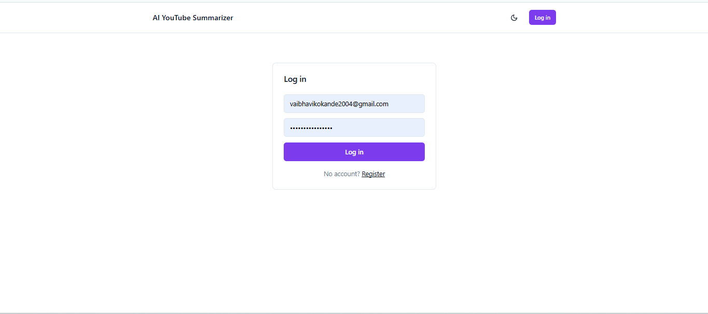
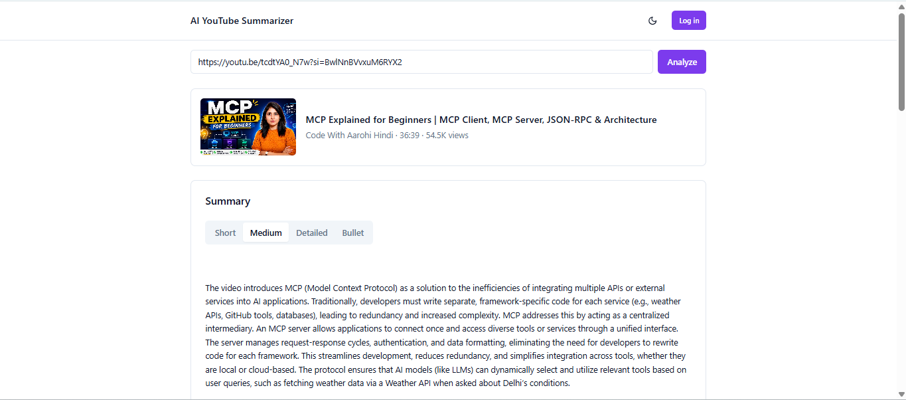
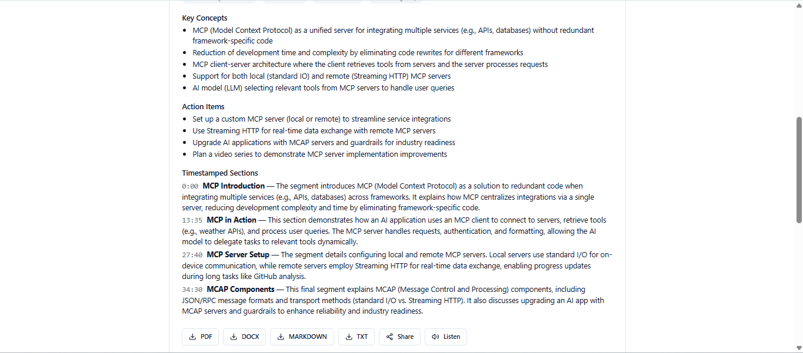
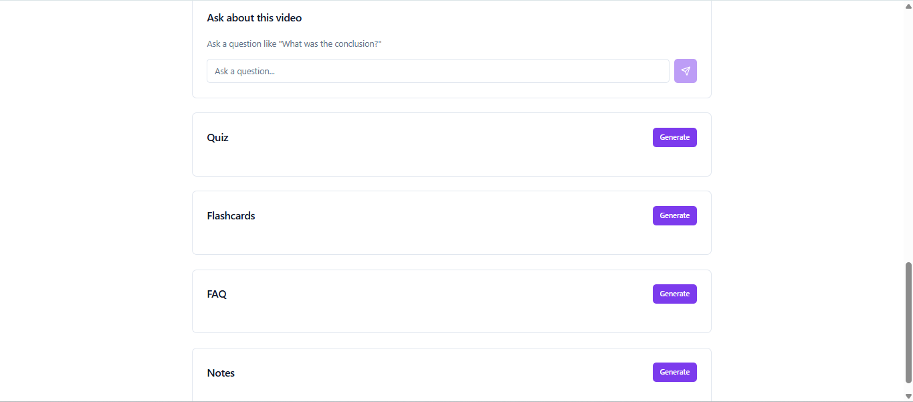
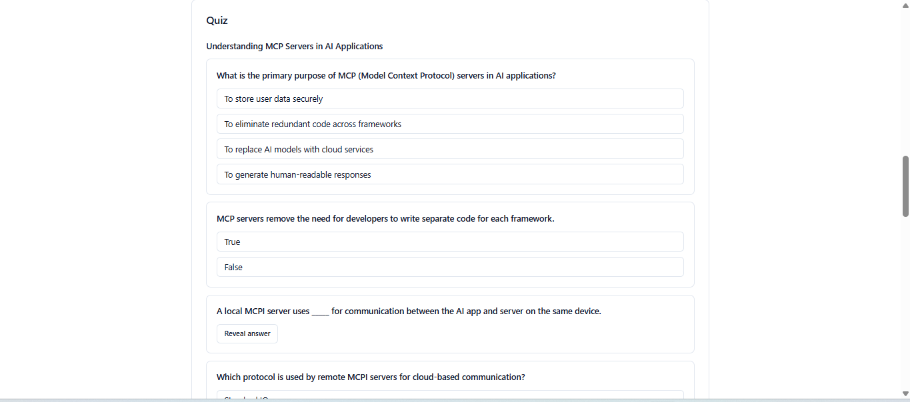
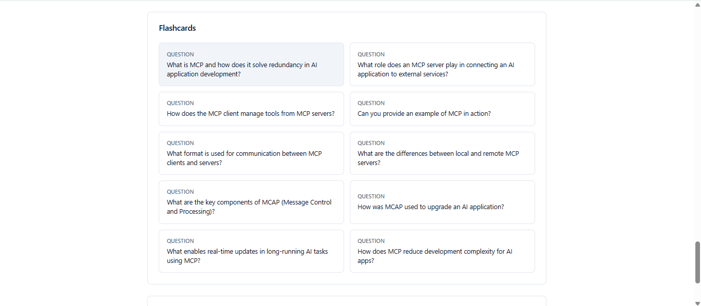
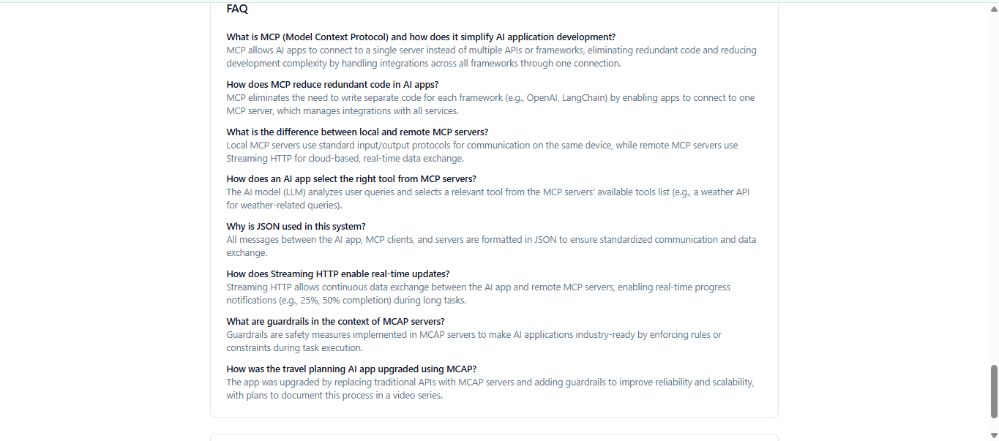
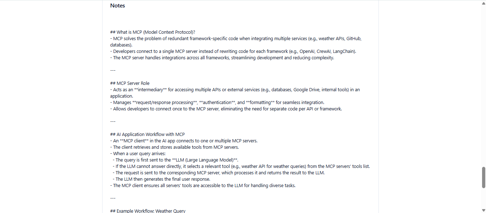

# AI YouTube Summarizer

A production-grade AI application that turns any YouTube video — lectures,
podcasts, interviews, tech talks, tutorials — into summaries, timestamped
notes, flashcards, quizzes, mind maps, and a RAG-powered chat you can ask
questions of.

> **Status:** All 15 steps complete. See
> [CHANGELOG.md](CHANGELOG.md) for what's landed and
> [docs/ARCHITECTURE.md](docs/ARCHITECTURE.md) for the system design.

## Verification status (read this before trusting the backend blindly)

This project was originally built on a machine with **no Python interpreter
and no Docker** — only Node.js — so the backend was carefully reasoned
through but never executed. In a later session, on the same constrained
machine (still no Docker, no admin rights), the full stack was actually
installed and run natively — Python via winget, PostgreSQL and Redis via
portable (installer-free) binaries — and driven end-to-end through a real
browser. That surfaced and fixed several real bugs pure code review had
missed:

- A `passlib`/`bcrypt` version incompatibility that broke every password
  hash (registration/login) the moment a real password was hashed.
- Outdated `yt-dlp` and `youtube-transcript-api` pins that no longer worked
  against current YouTube — both upgraded.
- A Celery + async-SQLAlchemy bug where the DB connection pool held
  connections from a dead event loop after the first task, crashing every
  job after it — fixed by disposing the engine per task.
- A missing `key` on the generator panels container, so switching to a new
  video reused the previous video's stale job state.
- Misleading error messages (e.g. a login failure always saying "Incorrect
  email or password" even when the real cause was an unreachable server) —
  replaced with a shared `getApiErrorMessage()` that surfaces the real cause.

With that, the full pipeline — register/login → paste a URL → fetch
transcript → LLM summarization/quiz/flashcards/FAQ/notes → render in the UI
— is now genuinely verified working (see Screenshots below), using
OpenRouter's free tier as the LLM provider (Claude/OpenAI/Gemini are also
wired up and work the same way with a funded/quota'd key — see
[Environment variables](#environment-variables)).

**Still unverified in this environment:** the RAG chat feature. It depends
on `chromadb`, whose `chroma-hnswlib` dependency needs a C++ compiler to
build (Visual Studio Build Tools), which in turn needs admin rights this
environment doesn't have. The rest of the app doesn't go down because of
this — `chroma_client.py` imports `chromadb` lazily, so only the chat
endpoint is affected. Install `chromadb` in an environment with a C++
toolchain (or Docker) to verify chat.

- **CI/CD workflows:** validated as syntactically correct YAML; not yet
  triggered by a real push before this README update.
- **Cloud deployment (Railway/Vercel):** configuration only —
  `backend/railway.toml` and `frontend/vercel.json` were written but not
  yet deployed.

The same careful, incremental review that built this project also caught
and fixed several design bugs along the way purely through reasoning (see
`CHANGELOG.md` Steps 8, 9, and 11) — and, in this later session, several
more through actually running it. Run the test suite yourself (see
[Testing](#testing)) before relying on any of it in production.

## Tech stack

| Layer | Choices |
|---|---|
| Frontend | React, TypeScript, Tailwind CSS, ShadCN UI, React Query, Axios, Framer Motion |
| Backend | Python, FastAPI, Pydantic, SQLAlchemy (async), Celery, Redis |
| Database | PostgreSQL (system of record), Redis (cache/broker), ChromaDB (vectors) |
| AI | LangChain, LangGraph, Sentence Transformers, Claude / OpenAI / Gemini (configurable) |
| Auth | JWT + Google OAuth |
| Deployment | Docker, Docker Compose, GitHub Actions, Railway (backend), Vercel (frontend) |

## Prerequisites

- Docker + Docker Compose
- Node.js 20+ and Python 3.12+ (only needed for running services outside Docker)
- API key for at least one LLM provider (Anthropic, OpenAI, or Google) — see
  [Environment variables](#environment-variables)

## Running locally (Docker Compose)

```bash
git clone <this-repo>
cd ai-youtube-summarizer

cp backend/.env.example backend/.env
cp frontend/.env.example frontend/.env
# edit backend/.env and add at least ANTHROPIC_API_KEY (default LLM_PROVIDER=claude)

docker compose up --build
```

- Frontend: http://localhost:5173
- Backend docs (Swagger): http://localhost:8000/docs
- Backend health check: http://localhost:8000/api/v1/health

## Running without Docker

**Backend**

```bash
cd backend
python -m venv .venv
. .venv/Scripts/activate   # Windows (PowerShell: .venv\Scripts\Activate.ps1)
pip install -r requirements-dev.txt
cp .env.example .env
uvicorn app.main:app --reload
```

**Frontend**

```bash
cd frontend
npm install
cp .env.example .env
npm run dev
```

## Screenshots

Captured from a real local run — register/login, paste a URL, generate.

| | |
|---|---|
| **Login** | **Video analyzed + Summary** |
|  |  |
| **Summary — key concepts, timestamped sections, export** | **Generators panel** |
|  |  |
| **Quiz** | **Flashcards** |
|  |  |
| **FAQ** | **Notes** |
|  |  |

## Environment variables

See [backend/.env.example](backend/.env.example) and
[frontend/.env.example](frontend/.env.example) for the full list. Key ones:

| Variable | Purpose |
|---|---|
| `LLM_PROVIDER` | `claude` \| `openai` \| `gemini` \| `openrouter` — selects the active LLM at runtime |
| `ANTHROPIC_API_KEY` / `OPENAI_API_KEY` / `GOOGLE_API_KEY` / `OPENROUTER_API_KEY` | Credentials for whichever provider(s) you enable. `openrouter` is OpenAI-API-compatible and has real free models (e.g. `OPENROUTER_MODEL=nvidia/nemotron-nano-9b-v2:free`) — no card required, good for trying the app without a funded provider account |
| `VECTOR_STORE_PROVIDER` | `chroma` (default, local) \| `pinecone` |
| `DATABASE_URL` | Async Postgres connection string |
| `JWT_SECRET_KEY` | Must be overridden with a real secret outside local dev |
| `GOOGLE_OAUTH_CLIENT_ID` / `GOOGLE_OAUTH_CLIENT_SECRET` | Google login |

## Testing

**Backend** — from `backend/`, with `requirements-dev.txt` installed:

```bash
pytest                          # unit + API tests (mocked I/O, no DB/services needed)
docker compose up -d postgres   # then, for integration tests against real Postgres:
pytest -m integration           # repository tests exercising real SQL (constraints, cascades)
```

Unit/API tests mock every external call (LLM providers, YouTube, Redis, Postgres) per
`docs/SPEC.md`'s testing rules. Integration tests (`tests/integration/`) are the one
place that talks to a real database — each test runs inside a transaction that's rolled
back afterward, so nothing persists between runs. They skip gracefully (not error) if no
Postgres is reachable.

**Frontend** — from `frontend/`:

```bash
npm test
```

Vitest + React Testing Library, covering the shared `useContentJob` hook (the
request/poll/result lifecycle every content generator uses), the Zustand auth
store, and presentational components.

## Project structure

```
ai-youtube-summarizer/
├── backend/        # FastAPI app (Clean Architecture — see docs/ARCHITECTURE.md)
├── frontend/        # React + TypeScript SPA
├── docker/           # nginx config, shared docker assets
├── docs/              # ARCHITECTURE.md, SPEC.md
├── .github/workflows/ # CI/CD (added in Step 14)
├── docker-compose.yml
└── CHANGELOG.md
```

## Roadmap

Tracked step-by-step; each step ships with working code, tests, and doc
updates before moving to the next:

1. ✅ Project scaffolding
2. ✅ Database models & migrations
3. ✅ YouTube metadata extraction
4. ✅ Transcript extraction (multi-language + translation)
5. ✅ LLM provider abstraction layer
6. ✅ Summarization engine (short/medium/detailed/bullet + timestamped)
7. ✅ RAG pipeline (chat with the video)
8. ✅ Mind maps, FAQ, flashcards, quiz, notes generators
9. ✅ Auth (JWT + Google OAuth), dashboard/history
10. ✅ Export (PDF/DOCX/Markdown/TXT), share links, TTS
11. ✅ Background jobs, caching, rate limiting
12. ✅ Frontend UI build-out
13. ✅ Test suite
14. ✅ CI/CD + cloud deployment
15. ✅ Documentation pass, including real screenshots from a local run (see above)

## API documentation

Interactive OpenAPI docs are auto-generated by FastAPI at `/docs` (Swagger)
and `/redoc` once the backend is running. Full endpoint list:

| Method | Path | Auth | Description |
|---|---|---|---|
| GET | `/health` | — | Liveness check |
| GET | `/video` | optional | Validate a URL, return video metadata (Redis-cached) |
| GET | `/transcript` | — | Fetch the transcript (multi-language, auto-translated) |
| POST | `/summarize` | optional | Enqueue a summary job → `{task_id}` (10/min) |
| POST | `/chat` | optional | Ask a question about the video — streams an SSE response |
| POST | `/quiz` | — | Enqueue a quiz job → `{task_id}` (10/min) |
| POST | `/flashcards` | — | Enqueue a flashcard job → `{task_id}` (10/min) |
| POST | `/faq` | — | Enqueue an FAQ job → `{task_id}` (10/min) |
| POST | `/notes` | optional | Enqueue a notes job → `{task_id}` (10/min) |
| GET | `/jobs/{task_id}` | — | Poll a job's status/result |
| POST | `/register` | — | Create an account, returns tokens |
| POST | `/login` | — | Email/password login |
| POST | `/login/google` | — | Google ID-token login |
| POST | `/refresh` | — | Exchange a refresh token for a new pair |
| GET | `/me` | required | Current user |
| GET | `/history` | required | Paginated, searchable viewing history |
| GET/POST/DELETE | `/favorites`(`/{video_id}`) | required | Favorite a video |
| GET/POST/DELETE | `/bookmarks`(`/{id}`) | required | Bookmark a timestamp within a video |
| GET | `/download` | — | Export a summary as PDF/DOCX/Markdown/TXT |
| POST | `/share` | — | Create a public share link for a summary |
| GET | `/share/{token}` | — (public) | View a shared summary — no account needed |
| GET | `/tts` | — | On-demand MP3 voice summary |

"optional" auth means the endpoint works anonymously but personalizes
(history, ownership) when a bearer token is present — see
`docs/ARCHITECTURE.md` §8.

## CI/CD

Three GitHub Actions workflows run on every push/PR (`.github/workflows/`):

| Workflow | What it does |
|---|---|
| `backend-ci.yml` | Spins up real Postgres + Redis services, applies Alembic migrations, runs `ruff`/`black`/`mypy`, then unit+API tests (`pytest -m "not integration"`) and integration tests (`pytest -m integration`) |
| `frontend-ci.yml` | `tsc --noEmit`, `eslint`, `vitest run`, `npm run build` |
| `docker-build.yml` | Builds both Dockerfiles (`docker/build-push-action`, not pushed anywhere) to catch Dockerfile breakage |

A fourth workflow, `deploy.yml`, handles continuous deployment but is
**gated behind a repository variable** (`ENABLE_DEPLOY`) so it doesn't
attempt a deployment before you've actually set up Railway/Vercel — see
below.

> **Honesty note:** this machine has no Python, Docker, or GitHub remote
> available, so none of these workflows have actually been *run* — only
> validated for correct YAML syntax. The backend-ci.yml job is the first
> place in this whole project where the ~50 backend tests (accumulated,
> unexecuted, since Step 1) would actually run, on GitHub's own
> Python-equipped runners. Expect the first real CI run to surface issues
> `black`/`mypy`/pytest would have caught immediately in a normal dev
> loop — that's what this pipeline is for.

## Deployment

**Backend + Celery worker → Railway** (`backend/railway.toml` configures the
build):

1. Create a Railway project, add a Postgres and a Redis addon.
2. Add a service with root directory `backend/` (Railway will detect
   `railway.toml` and build from `Dockerfile`).
3. Set environment variables on that service: `DATABASE_URL` and
   `REDIS_URL`/`CELERY_BROKER_URL`/`CELERY_RESULT_BACKEND` (from the addons
   above), `JWT_SECRET_KEY` (a real random secret), `LLM_PROVIDER` +
   whichever API key it needs, and `CORS_ORIGINS` (add your Vercel URL once
   you have it, see below).
4. Add a **second** service from the same repo/root directory for the
   Celery worker, but override its start command to
   `celery -A app.services.celery_app worker --loglevel=info` in that
   service's settings (Railway doesn't support two start commands from one
   `railway.toml`).
5. Note the backend service's public URL — you'll need it for the frontend.

**Frontend → Vercel** (`frontend/vercel.json` handles the SPA rewrite so
client-side routing works on refresh):

1. Import the repo into Vercel with root directory `frontend/`.
2. Set the `VITE_API_BASE_URL` environment variable to your Railway
   backend's URL + `/api/v1` (e.g. `https://your-app.up.railway.app/api/v1`)
   — without this, the frontend falls back to a relative `/api/v1` path
   that only works behind Vite's dev-server proxy, not in production.
3. Deploy, then go back to Railway and add this Vercel URL to the
   backend's `CORS_ORIGINS`.

**Enabling automatic deployment via GitHub Actions:**

1. In the repo's Settings → Secrets and variables → Actions, add secrets
   `RAILWAY_TOKEN`, `VERCEL_TOKEN`, `VERCEL_ORG_ID`, `VERCEL_PROJECT_ID`.
2. Add a repository **variable** (not secret) `ENABLE_DEPLOY` = `true`.
3. Pushes to `main` now deploy both services automatically.

Until `ENABLE_DEPLOY` is set, `deploy.yml`'s jobs are skipped entirely —
CI stays green without ever attempting a deploy you haven't configured.
